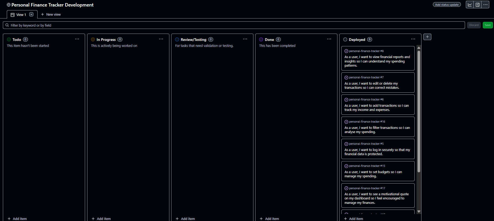
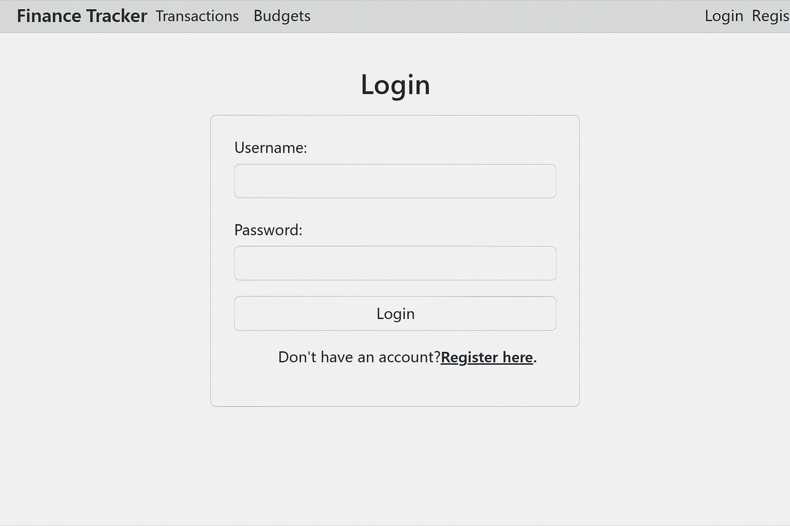
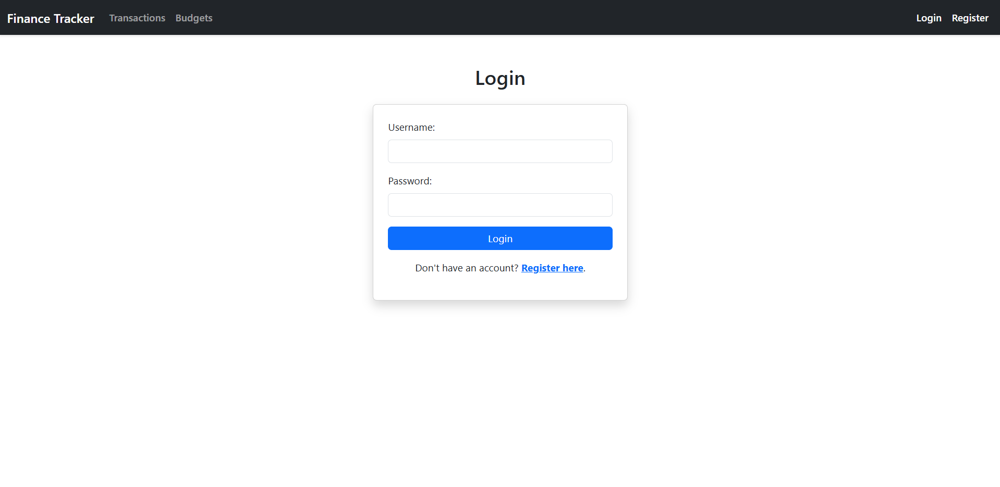
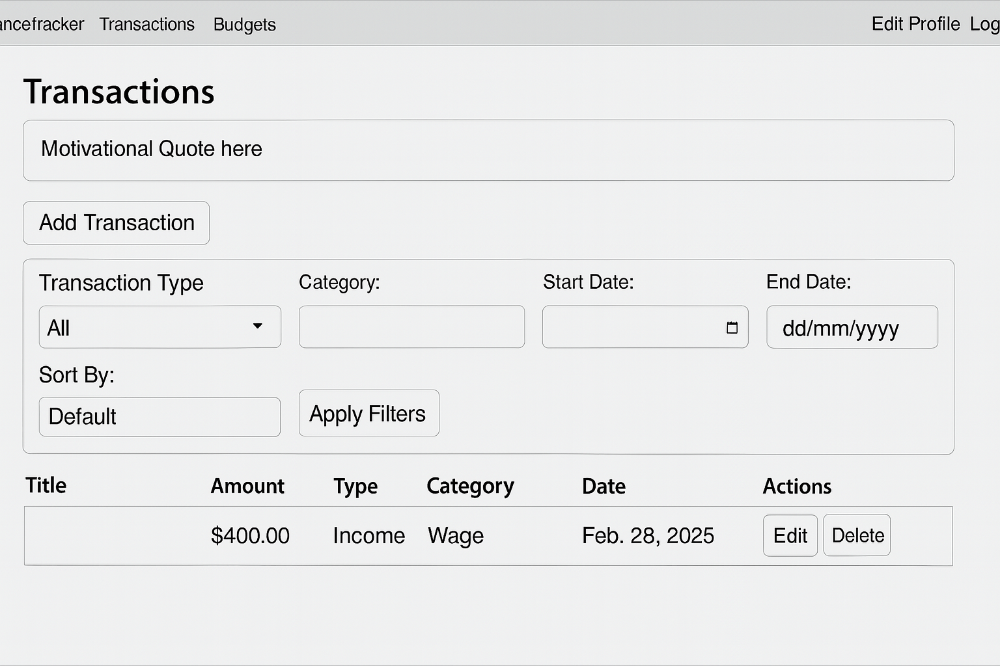
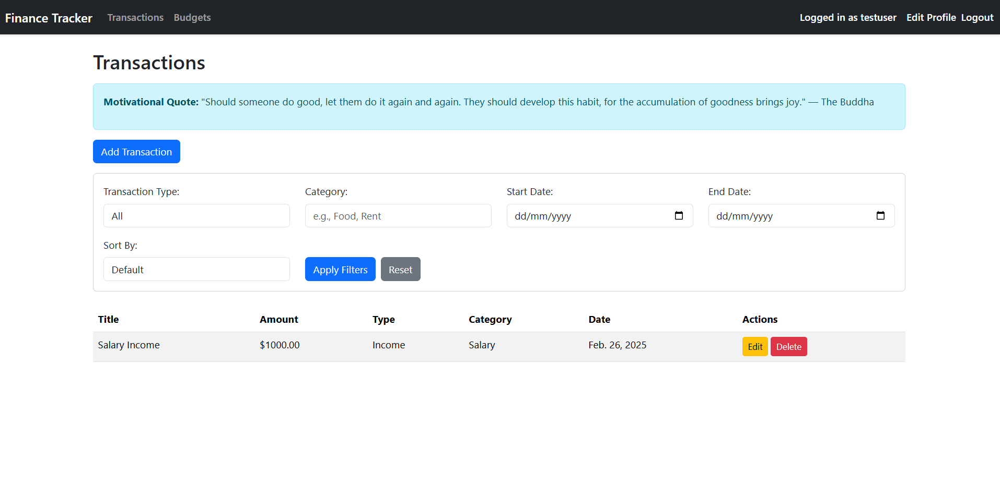
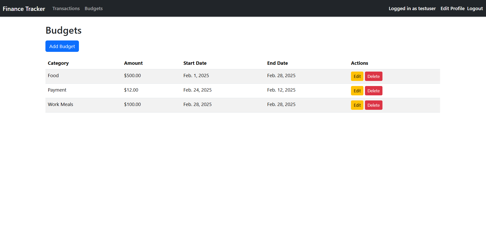
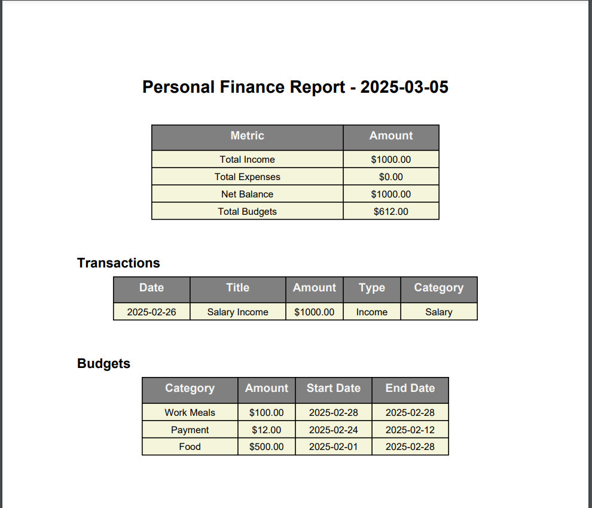
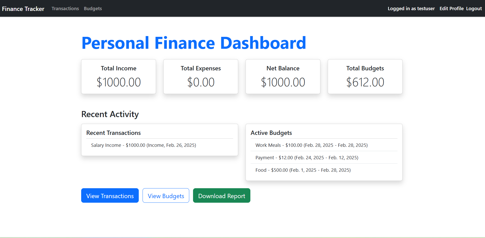
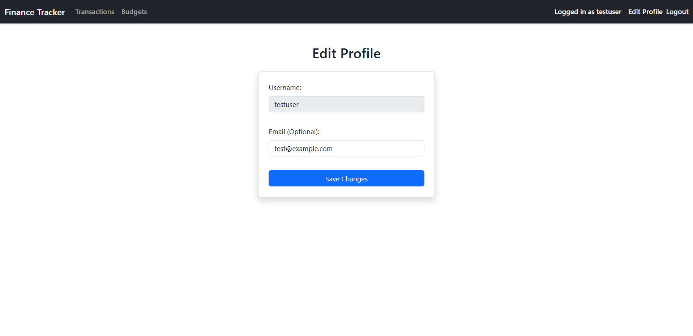

# Personal Finance Tracker

The Personal Finance Tracker is a full-stack web application built with Django that allows users to manage their personal finances in a structured and secure environment. Authenticated users can track income and expenses, set budgets, and generate downloadable financial summaries.

The application is designed with simplicity and functionality in mind. It supports user authentication, enforces ownership-based access to financial data, and includes PDF export functionality for records. This project was developed as part of a portfolio submission to demonstrate practical Django development skills and adherence to secure coding practices.


## Agile Development Process

This project followed an Agile approach using GitHub Projects for sprint and task management. All user stories were converted into GitHub Issues, prioritized, and tracked on a Kanban-style project board.

- **GitHub Project Board**: [View Board](https://github.com/N3wee/personal-finance-tracker/projects/1)
- Each **issue** represents a user story or technical task with clear acceptance criteria.
- Issues were assigned to categories like `To Do`, `In Progress`, and `Done`.
- Milestones were used to plan development phases, and progress was reviewed frequently.


*A screenshot of the GitHub Project board showing To Do, In Progress, and Done columns

## Technologies Used

### Frameworks & Libraries
- **[Django 5.1.6](https://www.djangoproject.com/)** – High-level Python web framework for rapid development.
- **[Bootstrap 5](https://getbootstrap.com/)** – Responsive frontend framework for styling and layout.
- **[dj-database-url](https://github.com/jacobian/dj-database-url)** – Simplified database configuration for deployment.
- **[python-dotenv](https://pypi.org/project/python-dotenv/)** – Loads environment variables from a `.env` file.
- **[whitenoise](https://whitenoise.evans.io/)** – Serves static files efficiently in production.
- **[django-widget-tweaks](https://pypi.org/project/django-widget-tweaks/)** – Allows flexible customization of form fields in templates.

### Database
- **[PostgreSQL](https://www.postgresql.org/)** – Relational database used in both local and Heroku environments.

### Deployment
- **[Heroku](https://www.heroku.com/)** – Cloud platform used for hosting the live application.

### Tools
- **[Git](https://git-scm.com/)** – Version control.
- **[GitHub](https://github.com/)** – Code hosting and collaboration.
- **[Flake8](https://flake8.pycqa.org/)** – Enforces Python style guide compliance.
- **[pytest](https://docs.pytest.org/)** – Framework for writing and running tests.

## Installation & Setup

Follow the steps below to run the project locally on your machine:

### 1. Clone the Repository
```bash
git clone https://github.com/N3wee/personal-finance-tracker.git
cd personal-finance-tracker
```

### 2. Set Up Virtual Environment
Create and activate a virtual environment:

```bash
python -m venv venv
# Windows
venv\Scripts\activate
# macOS/Linux
source venv/bin/activate
```

### 3. Install Dependencies
```bash
pip install -r requirements.txt
```

### 4. Configure Environment Variables
Create a `.env` file in the root directory and add the following:

```ini
SECRET_KEY=your-django-secret-key
DEBUG=True
```

You can generate a new secret key using:

```bash
python -c 'from django.core.management.utils import get_random_secret_key; print(get_random_secret_key())'
```

### 5. Set Up the Database
Ensure PostgreSQL is running and then apply migrations:

```bash
python manage.py makemigrations
python manage.py migrate
```

### 6. Create Superuser (Optional)
```bash
python manage.py createsuperuser
```

### 7. Run the Development Server
```bash
python manage.py runserver
```

Then visit http://127.0.0.1:8000/ in your browser.

## Features

This Personal Finance Tracker provides users with a streamlined way to manage their income, expenses, and budgets. The key features include:

### ✅ Authentication
- Secure user registration and login system
- Login required for accessing and managing personal financial data



### ✅ Transactions Management
- Add income or expense transactions with details like category, date, amount, and payment method
- Edit or delete existing transactions
- Transactions are displayed in a chronological list



### ✅ Budgeting
- Create budgets for specific categories and date ranges
- View and manage multiple budgets
- Prevent unauthorized access or editing of budgets by other users


### ✅ PDF Export
- Generate and download PDF reports of transactions for offline records or printing


### ✅ Responsive User Interface
- Clean, user-friendly interface built with HTML/CSS and Django templating
- Mobile-responsive layout for easy access across devices



### ✅ Error Handling & Logging
- Graceful error handling with appropriate permission checks
- Logging for permission errors and failed form submissions

### ✅ Security Best Practices
- Secret key and environment variables handled through `.env` file
- DEBUG mode disabled in production

## Design Considerations

The design of the Personal Finance Tracker prioritizes simplicity, clarity, and ease of use. The following principles guided the UI/UX decisions:

- **Color Scheme**: 
  - Green is used to indicate positive financial actions (e.g., income).
  - Red/orange shades represent expenses or warnings (e.g., overspending).
  - Neutral grays and blues are used to keep the interface clean and reduce visual fatigue.

- **Typography**: 
  - A modern sans-serif font is used for readability across all screen sizes.
  - Font sizes are scaled responsively to maintain accessibility and clarity.

- **Layout & Navigation**:
  - A consistent navbar provides quick access to all main features (transactions, budgets, export, logout).
  - Forms are centered and easy to use with clear labels, using Bootstrap for responsiveness.

- **Mobile Responsiveness**:
  - Bootstrap's grid system ensures a seamless experience on both desktop and mobile devices.
  - Navigation collapses into a hamburger menu on smaller screens.

- **User Feedback**:
  - Toast messages and inline form validation provide real-time feedback during interactions.
  - Pages include success/error indicators for user confidence.

The overall goal was to create a calm, non-intimidating interface for users to manage their finances confidently.


## 🗂 Data Models & Schema (ERD)

This section outlines the key models used in the Personal Finance Tracker project and their relationships.

### 👤 User
> Django’s built-in User model

- Each user can have multiple transactions
- Each user can have multiple budgets

---

### 💰 Transaction

| Field           | Type            | Notes                                           |
|----------------|------------------|--------------------------------------------------|
| `user`         | ForeignKey → User | Each transaction belongs to a user              |
| `title`        | CharField         | Title of the transaction                        |
| `amount`       | DecimalField      | Must be greater than 0                          |
| `transaction_type` | ChoiceField   | 'Income' or 'Expense'                           |
| `category`     | CharField         | Custom user-defined category                    |
| `date`         | DateField         | Defaults to now                                 |
| `notes`        | TextField         | Optional notes                                  |
| `recurring`    | BooleanField      | True/False flag                                 |
| `payment_method` | ChoiceField     | Cash, Card, Bank Transfer                       |

---

### 📊 Budget

| Field           | Type            | Notes                                           |
|----------------|------------------|--------------------------------------------------|
| `user`         | ForeignKey → User | Each budget belongs to a user                   |
| `category`     | CharField         | Category of the budget                          |
| `amount`       | DecimalField      | Budget amount                                   |
| `start_date`   | DateField         | Defaults to now                                 |
| `end_date`     | DateField         | Optional                                        |
| `notes`        | TextField         | Optional notes                                  |

---

### 🔗 Relationships

```plaintext
+--------+         +-------------+         +--------+
|  User  |<------->| Transaction |         | Budget |
+--------+         +-------------+         +--------+
     |                 |  FK: user              | FK: user
     |                 |                        |
     +----------------+------------------------+
```

This schema enables per-user data control and secure financial record management. Each transaction and budget entry is scoped to the logged-in user, ensuring privacy and data ownership.


## Testing & Validation

### ✅ Overview

Testing was carried out using a combination of **automated unit tests**, **manual exploratory testing**, and **code linting tools** to ensure the app functions as expected and meets security and data integrity standards.

---

### ✅ Automated Unit Tests

Django's built-in testing framework was used to create a suite of unit tests located in `transactions/tests.py`.

#### Key Coverage Areas:

| Area             | Description                                                                            |
|------------------|----------------------------------------------------------------------------------------|
| Transactions     | Add, edit, delete, list transactions. Ensures users can only access their own records. |
| Budgets          | Create, edit, delete budgets with permission enforcement.                              |
| Authentication   | Access to views is restricted to authenticated users.                                  |
| Permissions      | Non-owners receive 403 responses when trying to access another user's data.            |

Run all tests using:

```bash
python manage.py test
```

output:

```
Found 12 test(s).
Creating test database for alias 'default'...
System check identified no issues (0 silenced).
.Permission denied: User otheruser tried to delete budget 3 owned by testuser
Forbidden: /transactions/budgets/3/delete/
..Permission denied: User otheruser tried to edit budget 5 owned by testuser
Forbidden: /transactions/budgets/5/edit/
...Permission denied: User otheruser tried to delete transaction 3 owned by testuser
Forbidden: /transactions/transactions/3/delete/
..Permission denied: User otheruser tried to edit transaction 5 owned by testuser
Forbidden: /transactions/transactions/5/edit/
..
----------------------------------------------------------------------
Ran 12 tests in 14.642s

OK
Destroying test database for alias 'default'...
```

---

### ✅ Manual Testing

Manual testing was conducted to supplement automated tests, focusing on user experience, form behavior, and deployment functionality.

| Feature                  | Test Case                                                                 | Result     |
|--------------------------|---------------------------------------------------------------------------|------------|
| Login/Logout             | Login with valid/invalid credentials; logout flow                         | ✅ Success |
| Transactions CRUD        | Add/edit/delete transactions, including validation edge cases             | ✅ Success |
| Budgets CRUD             | Add/edit/delete budget records                                             | ✅ Success |
| PDF Export               | Generate PDF with/without data present                                     | ✅ Success |
| Permissions              | Attempt to view/edit/delete another user’s data                           | ✅ Blocked |
| Deployment               | Heroku live site renders correctly, no DEBUG leaks                        | ✅ Success |
| Responsiveness           | UI behaves correctly across desktop and mobile                            | ✅ Success |

---

### ✅ Code Quality & Linting

Tools used:
- `flake8`: PEP8 compliance
- `black`: Consistent code formatting
- `isort`: Organize imports

To check manually:

```bash
flake8 --max-line-length=120 --exclude=venv
```

> All code passed linting with no critical errors or warnings in the final version.

---

### ✅ Environment & Security

- ✅ `SECRET_KEY` stored in `.env` and not exposed in source code.
- ✅ `DEBUG=False` in production.
- ✅ Sensitive config variables set via Heroku Config Vars.
- ✅ `.env` and `__pycache__` excluded via `.gitignore`.

---

### ✅ Summary

All key functionalities were tested through both automated and manual testing methods. The application passes all permission checks, form validation, and CRUD workflows with appropriate handling of edge cases.

---

## Deployment

This project is deployed on [Heroku](https://www.heroku.com/) using the **Heroku Python Buildpack**. Below are the deployment steps and configurations used.

### ⚙️ Deployment Steps

1. **Create a Heroku App**
   ```bash
   heroku create your-app-name
   ```

2. **Add Heroku Remote (if not already added)**
   ```bash
   heroku git:remote -a your-app-name
   ```

3. **Set Config Vars**
   Go to your Heroku Dashboard > Settings > Reveal Config Vars, and add:

   - `SECRET_KEY`: Your Django secret key
   - `DEBUG`: `False`
   - `ALLOWED_HOSTS`: your Heroku app URL (e.g. `your-app-name.herokuapp.com`)
   - Any other variables from your `.env` file

4. **Install Heroku CLI (if not installed)**  
   [Heroku CLI Download](https://devcenter.heroku.com/articles/heroku-cli)

5. **Push to Heroku**
   ```bash
   git push heroku main
   ```

6. **Run Database Migrations on Heroku**
   ```bash
   heroku run python manage.py migrate
   ```

7. **Create a Superuser (Optional)**
   ```bash
   heroku run python manage.py createsuperuser
   ```

8. **Open the Live App**
   ```bash
   heroku open
   ```

### 📁 Procfile

Ensure your project contains a `Procfile` with the following content:
```procfile
web: gunicorn finance_tracker.wsgi
```

### 📂 Static Files

The project uses **Whitenoise** for serving static files in production. Make sure you’ve run:
```bash
python manage.py collectstatic
```

### 📚 Credits / Acknowledgements

This project was developed as part of a Django portfolio submission for educational purposes. The following resources and tools were instrumental in its development:

- [Django Documentation](https://docs.djangoproject.com/) – for framework guidance and best practices.
- [Bootstrap Documentation](https://getbootstrap.com/) – for responsive frontend components.
- [Heroku Documentation](https://devcenter.heroku.com/) – for deployment help and environment configuration.
- [Real Python Tutorials](https://realpython.com/tutorials/django/) – for inspiration and reference on Django patterns.
- [GitHub Copilot & ChatGPT](https://openai.com/chatgpt) – for development assistance and troubleshooting during coding and testing.
- Stack Overflow and Django Discord – for community support.

If any external code or references were adapted in the project, they were modified appropriately and acknowledged where used.


## Possible Future Improvements

While the current version of the Personal Finance Tracker meets its core objectives, there are several enhancements and new features that could be explored in future iterations:

- **Recurring Transactions**  
  Add support for recurring income or expense entries (e.g., monthly rent, salary).

- **Data Visualization**  
  Integrate simple charts or graphs to visualize spending trends over time using libraries like Chart.js or D3.js.

- **Multi-Currency Support**  
  Enable users to manage transactions in different currencies with real-time exchange rate integration.

- **Tagging System**  
  Allow users to tag transactions (e.g., "holiday", "business") for better filtering and analysis.

- **Enhanced Budget Alerts**  
  Notify users when their spending nears or exceeds budget thresholds via email or in-app alerts.

- **Search & Filters**  
  Add dynamic filtering and search functionality for easier transaction lookup.

- **Two-Factor Authentication**  
  Improve account security with optional two-factor authentication (2FA) during login.

These improvements could significantly enhance user experience, accessibility, and functionality.


## License

This project is intended for **educational purposes only** and does not carry a formal software license.  
It was developed as part of a portfolio submission to demonstrate Django development proficiency.

---

## Contact / Author Info

**Author**: Nathan Sweeney  
**GitHub**: [github.com/N3wee](https://github.com/N3wee)  

For any questions regarding this project, feel free to reach out via GitHub or email.